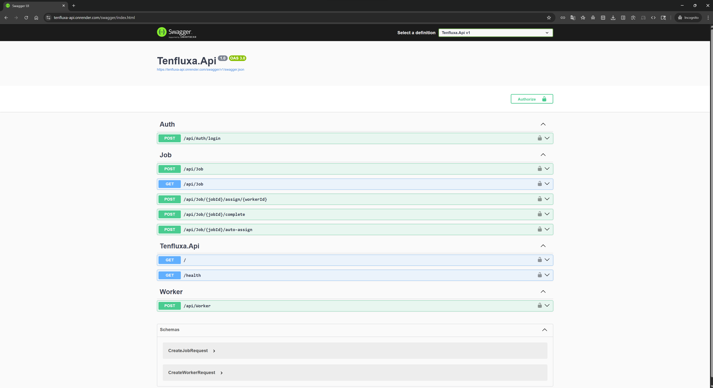
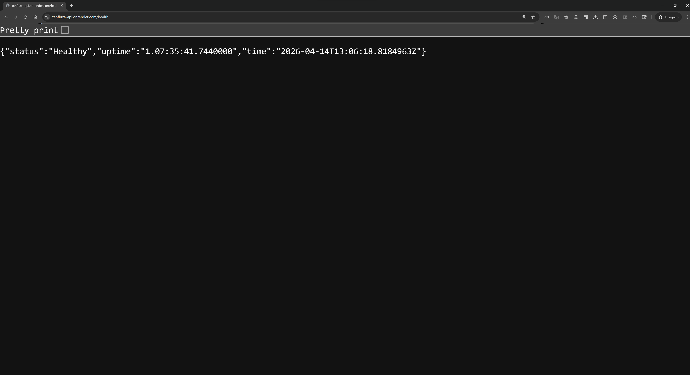
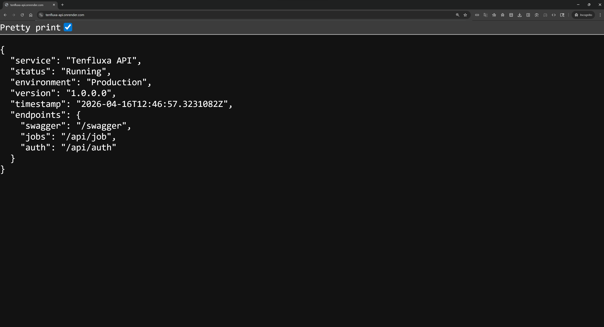

# Tenfluxa

> **Multi-Tenant Event-Driven AI Service Operations Platform (Production-Ready Backend)**

🌐 Live API: https://tenfluxa-api.onrender.com  
📄 Swagger: https://tenfluxa-api.onrender.com/swagger  
💻 Tech: .NET 8, PostgreSQL, Docker, CI/CD (GitHub Actions)

---

## Why this project?

Tenfluxa simulates a real-world service operations platform where:

* Jobs are created and processed asynchronously
* Workers are assigned dynamically
* Background processing handles workloads
* Real-time updates notify clients
* AI-based decision logic optimizes assignments

This project demonstrates **production-grade backend engineering**, not just CRUD APIs.

---

## Live Demo

| Feature      | Endpoint    |
| ------------ | ----------- |
| API Root     | `/`         |
| Health Check | `/health`   |
| Swagger UI   | `/swagger`  |
| Jobs API     | `/api/job`  |
| Auth API     | `/api/auth` |

### Example Response (Production API)

This endpoint confirms service health and provides runtime metadata.

```json
GET /

{
  "service": "Tenfluxa API",
  "status": "Running",
  "environment": "Production",
  "version": "1.0.0",
  "timestamp": "2026-04-14T12:51:30Z",
  "machine": "render-instance",
  "endpoints": {
    "swagger": "/swagger",
    "jobs": "/api/job",
    "auth": "/api/auth"
  }
}
```

---

## 🧠 Architecture

```
Client
   ↓
API Layer (Controllers, SignalR)
   ↓
Application Layer (Use Cases, Services)
   ↓
Domain Layer (Entities, Business Rules)
   ↓
Infrastructure Layer
(PostgreSQL, Hangfire, External Services)
```

---

## Features

* Multi-Tenant Architecture (Tenant isolation)
* JWT Authentication & Authorization
* Job Management System (Create, Assign, Complete)
* Background Processing using Hangfire
* Real-time communication using SignalR
* AI-based Worker Assignment (Scoring Logic)
* RESTful APIs with Swagger documentation
* Production deployment on Render
* CI/CD pipeline using GitHub Actions

---

## Production Engineering Highlights

* Dockerized application
* Environment-based configuration (no hardcoded secrets)
* PostgreSQL cloud database integration
* Automated CI/CD pipeline
* Health check endpoint for monitoring
* Automatic database migrations on startup

---

## Tech Stack

* .NET 8 / ASP.NET Core Web API
* PostgreSQL
* Entity Framework Core + Dapper
* JWT Authentication
* Hangfire
* SignalR
* Docker
* GitHub Actions (CI/CD)
* Render (Cloud Deployment)

---

## 📸 Screenshots

### 🔹 Swagger UI



### 🔹 Health Endpoint



### 🔹 API Root



---

## Run Locally

```bash
git clone https://github.com/alinaib19/Tenfluxa.git
cd Tenfluxa
docker-compose up --build
```

---

## Environment Variables

Required environment variables:

* `ConnectionStrings__DefaultConnection`
* `Jwt__Key`
* `Jwt__Issuer`
* `Jwt__Audience`
* `Jwt__ExpiryMinutes`
* `ASPNETCORE_ENVIRONMENT`

---

## Future Improvements

* Advanced AI-based worker assignment (ML model)
* Distributed job processing (scaling workers)
* Rate limiting & caching (Redis)
* Observability (logging, tracing, metrics)
* Kubernetes deployment

---

## Goal

To build a **scalable, production-ready backend system** that demonstrates:

* Clean Architecture
* Real-world system design
* Background job processing
* Cloud deployment practices

---

## Author

Alina BI  
Full-stack .NET Developer

---

## If you like this project

Give it a star ⭐ on GitHub and feel free to contribute!
